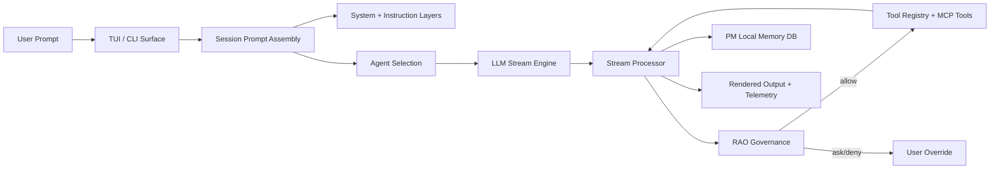

<p align="center">
  
</p>
<p align="center"><strong>DAX — Deterministic AI eXecution</strong></p>
<p align="center">The execution control plane for AI-assisted SDLC.</p>

---

## Overview

DAX is the execution control plane for AI-assisted SDLC. It is built for teams and ambitious builders who want AI speed with explicit control, traceability, and customization.

The flagship experience is a transcript-first terminal workspace:

- DAX explains what it found, what it is checking, and what happens next.
- risky actions go through explicit review and approval instead of hidden tool calls.
- detailed trace and context stay available on demand without overwhelming the main conversation.

Instead of a free-running coding chat, DAX uses **RAO** as a governed execution loop:

1. **Run** – the model proposes the next action.
2. **Audit** – permission rules and runtime checks evaluate whether the action should proceed, ask, or stop.
3. **Override** – humans allow, deny, or persist the decision.

## Guides

- Full docs index: [docs/README.md](docs/README.md)
- Start here: [docs/product/start-here.md](docs/product/start-here.md)
- Build on DAX: [docs/product/build-on-dax.md](docs/product/build-on-dax.md)
- Architecture deep dive: [docs/architecture/ARCHITECTURE.md](docs/architecture/ARCHITECTURE.md)
- Provider setup: [docs/product/providers.md](docs/product/providers.md)
- Peer prerelease install/validation: [docs/product/prerelease.md](docs/product/prerelease.md)
- Distribution channels: [docs/product/distribution.md](docs/product/distribution.md)

## Workspace Role

DAX is the canonical execution product in the `MYAIAGENTS` workspace.

- `dax`: local-first governed execution product
- `soothsayer`: multi-user web platform and orchestration shell
- `workspace-mcp` in Soothsayer: kernel and policy contract

DAX is responsible for the CLI/TUI, local server/API, session runtime, tool execution, provider integrations, and RAO/PM behavior at the execution layer.

Your `workspace-mcp` kernel from Soothsayer can be used with DAX today as an external local MCP server.

## Who DAX Is For

| Ideal for                                                 | Not optimized for                                   |
| --------------------------------------------------------- | --------------------------------------------------- |
| Engineering teams adopting AI under real delivery rules   | Chat-only experimentation with no governance        |
| Platform and developer productivity teams                 | IDE-first workflows where the editor is the product |
| Technical founders with mixed technical/non-technical ops | "Replace developers" positioning                    |
| Open-source builders who want governed local execution    | AGI-adjacent marketing claims                       |

## Core Capabilities

- Transcript-first terminal workspace (TUI) with milestone-based progress and review surfaces.
- Multi-provider support: OpenAI, Google/Gemini, Anthropic, Ollama, more via RAO tools.
- Governed approvals with allow/ask/deny rules, persisted approvals, and audit trace recording.
- Project Memory (PM) stored in `pm.sqlite` for durable context.
- ELI12 mode that rewrites responses in plain language.
- Built-in review and diagnostics via `dax approvals`, `dax doctor`, and docs workflows.
- `dax plan` exposes the canonical planning workflow so operators can inspect work before execution.
- Explicit execution previews in `dax run` so operators can inspect the work request before execution begins.
- `dax artifacts` exposes retained outputs.
- `dax audit` exposes trust posture by summarizing approvals, overrides, evidence presence, and audit findings.
- `dax verify` judges whether a session has enough evidence and governance signal to reach a stronger trust posture.
- `dax release check` judges whether a trusted session is ready for review, handoff, or shipping.
- `dax explore <path>` inspects a repository and returns structured execution-oriented understanding.
- Theme system with quick-switch profiles.

## Canonical Workflows

- Start or continue governed work: `dax`, `dax plan`, `dax run`, `dax explore`
- Review and inspect: `dax docs`, `dax mcp`, `dax approvals`, `dax artifacts`, `dax audit`, `dax verify`, `dax release`
- Diagnose and configure: `dax doctor`, `dax auth`, `dax models`

## Product Pillars

### RAO (Run → Audit → Override)

- Explicit permissions for sensitive actions.
- Persistent approvals for recurring scenarios.
- Human override for high-risk operations.
- Audit and override events recorded for traceability.

### Project Memory (PM)

- Long-lived constraints, preferences, and notes.
- Session continuity across runs.
- Operational memory that stays separate from transient chat state.

### Terminal Workstation (TUI)

- Header: one state sentence, one useful detail.
- Stream: calm SDLC teammate voice with milestone-based progress.
- Sidebar: live system truth (session state, trust score, artifacts).
- Overlays: evidence views (timeline, artifact inspection, approvals).

### Normal and ELI12 Modes

- Normal mode is concise and implementation-oriented.
- ELI12 keeps the same structure but explains what the result means and what happens next in simpler language.

## Quickstart

### Prerequisites

- Bun `1.3.x`
- Git

### Install

```bash
git clone https://github.com/anomalyco/dax.git
cd dax
bun install
```

### Run DAX

```bash
bun run dev
```

### Run the CLI

```bash
# Run workflow
cd packages/dax
bun run bin/dax workflow run repo-health <path>

# List workflows
bun run bin/dax workflow list

# Inspect session
bun run bin/dax workflow inspect <session-id>
```

### Validate Quality Locally

```bash
cd packages/dax
bun run test
```

## Architecture Overview



## License

MIT
