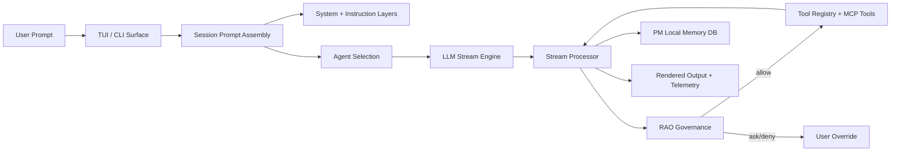

<p align="center">
  
</p>
<p align="center"><strong>DAX — Deterministic AI eXecution</strong></p>
<p align="center">Governed AI orchestration for real software delivery.</p>

---

## Overview

DAX is a policy-first AI execution product. It is built for teams that want AI speed **and** predictable, auditable automation.

Instead of a free-running coding chat, DAX uses **RAO**:

1. **Run** – the model proposes the next action.
2. **Audit** – policy evaluates scope, risk, and context.
3. **Override** – humans allow, deny, or persist the decision.

## Who DAX Is For

| Ideal for                                             | Not optimized for                                 |
| ----------------------------------------------------- | ------------------------------------------------- |
| Engineering teams that need traceable AI actions      | Chat-only experimentation with no governance      |
| Startups that want fast iteration with guardrails     | Scenarios where policy/auditability do not matter |
| Mixed technical/non-technical groups using ELI12 mode |                                                   |

## Core Capabilities

- Terminal-native AI orchestration (SolidJS TUI with live timeline and diff panes).
- Multi-provider support: OpenAI, Google/Gemini, Anthropic, Ollama, more via RAO tools.
- RAO policy gating with allow/ask/deny + persisted approvals.
- Project Memory (PM) stored in `pm.sqlite` for durable context.
- ELI12 mode that rewrites responses in plain language.
- Pane system for `artifact`, `diff`, `rao`, and `pm` views.
- Theme system with quick-switch profiles.

## Product Pillars

### RAO (Run → Audit → Override)

- Explicit permissions for sensitive actions.
- Persistent approvals for recurring scenarios.
- Human override for high-risk operations.

### Project Memory (PM)

- Long-lived constraints, preferences, and notes.
- Session continuity across runs.
- Operational memory that stays separate from transient chat state.

### Orchestration-First UX

- Real-time stream stages and tool usage in the TUI.
- Approval UX for risky actions and policy prompts.
- Natural language programming focus with minimal ceremony.

## Quickstart

### Prerequisites

- Bun `1.3.x`
- Git

### Install

```bash
git clone https://github.com/ShaileshRawat1403/dax.git
cd dax
bun install
```

### Run DAX

```bash
bun run dev
```

### Validate Quality Locally

```bash
bun run typecheck:dax
bun run test:dax
```

### Full Release Verification Pipeline

```bash
bun run release:verify
```

### Build Release Artifacts

```bash
bun run release
```

### Peer Pre-release (GitHub Releases)

- Build release artifacts locally: `bun run release`
- Upload prerelease assets to GitHub (draft): `DAX_VERSION=1.0.0-beta.1 bun run release:publish`
- Publish prerelease immediately: `DAX_VERSION=1.0.0-beta.1 bun run release:publish:live`
- Peer install guide: `docs/prerelease.md`

## Configuration Snapshot

DAX uses per-project and global config for provider and policy controls. Example:

```json
{
  "enabled_providers": ["openai", "google", "anthropic", "ollama"]
}
```

Default UX profile:

- Primary agents: `build`, `plan`, `explore`, `docs`
- RAO enabled by default
- PM enabled by default

## Gemini Auth (Google Provider)

Recommended flow: reuse Gemini CLI tokens.

```bash
gemini login
export GEMINI_OAUTH_CREDS_PATH=$HOME/.gemini/oauth_creds.json
```

Then connect the `google` provider inside DAX and pick “Gemini CLI login”. To opt into maintainer-only email OAuth:

```bash
export DAX_GEMINI_EMAIL_AUTH=1
export DAX_GEMINI_OAUTH_CLIENT_ID=...
export DAX_GEMINI_OAUTH_CLIENT_SECRET=...
```

## UX Defaults & Recommendations

- Terminal font size: `13–15`
- Line height: `1.15–1.3`
- Preferred fonts: `JetBrains Mono`, `Berkeley Mono`, `IBM Plex Mono`, `Monaspace Argon`
- Use high-contrast themes for long sessions (theme cycler built into TUI).

## Security & Governance Notes

- All sensitive actions pass through RAO approvals.
- External-directory access and risky shell commands are permission-gated.
- Policy profile (balanced/strict) can be tuned per project.

## Architecture Overview



## Maintainer Pre-Release Checklist

1. `bun install`
2. `bun run typecheck:dax`
3. `bun run test:dax`
4. `bun run release:verify`
5. `bun run release`
6. Smoke-test the TUI on narrow + wide terminals
7. Verify provider login flows (OpenAI, Google/Gemini, Anthropic, Ollama)
8. Verify RAO approvals and policy profile behavior

## License

MIT
