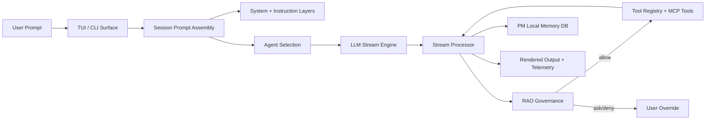

<p align="center">
  
</p>
<p align="center"><strong>DAX — Deterministic AI eXecution</strong></p>
<p align="center">Governed AI orchestration for real software delivery.</p>

---

## Overview

DAX is a policy-first AI execution product. It is built for teams that want AI speed **and** predictable, auditable automation.

Instead of a free-running coding chat, DAX uses **RAO**:

1. **Run** – the model proposes the next action.
2. **Audit** – policy evaluates scope, risk, and context.
3. **Override** – humans allow, deny, or persist the decision.

## Guides

- Full docs index: [docs/README.md](docs/README.md)
- Start here: [docs/start-here.md](docs/start-here.md)
- Non-dev quickstart: [docs/non-dev-quickstart.md](docs/non-dev-quickstart.md)
- Non-dev quick guide: [docs/non-developer-guide.md](docs/non-developer-guide.md)
- Audit agent (beta): [docs/audit-agent.md](docs/audit-agent.md)
- GitHub + CI integration lane: [docs/integrations-github-ci.md](docs/integrations-github-ci.md)
- Build on DAX: [docs/build-on-dax.md](docs/build-on-dax.md)
- Architecture deep dive: [ARCHITECTURE.md](ARCHITECTURE.md)
- Provider setup: [docs/PROVIDERS.md](docs/PROVIDERS.md)
- Peer prerelease install/validation: [docs/prerelease.md](docs/prerelease.md)
- Distribution channels (script/Homebrew/Winget): [docs/distribution.md](docs/distribution.md)
- Release readiness guide: [docs/release-readiness.md](docs/release-readiness.md)
- Workspace decision record: [docs/WORKSPACE_DECISION_RECORD.md](docs/WORKSPACE_DECISION_RECORD.md)
- Repo boundaries: [docs/REPO_BOUNDARIES.md](docs/REPO_BOUNDARIES.md)
- `dax-cli` donor inventory: [docs/DAX_CLI_DONOR_INVENTORY.md](docs/DAX_CLI_DONOR_INVENTORY.md)
- Use `workspace-mcp` with DAX: [docs/WORKSPACE_MCP_WITH_DAX.md](docs/WORKSPACE_MCP_WITH_DAX.md)
- DAX absorption strategy: [docs/DAX_ABSORPTION_STRATEGY.md](docs/DAX_ABSORPTION_STRATEGY.md)

## Workspace Role

DAX is the canonical execution product in the `MYAIAGENTS` workspace.

- `dax`: local-first governed execution product
- `soothsayer`: multi-user web platform and orchestration shell
- `workspace-mcp` in Soothsayer: kernel and policy contract
- `dao`: archived/reference-only architecture line

DAX is responsible for the CLI/TUI, local server/API, session runtime, tool execution, provider integrations, and RAO/PM behavior at the execution layer.

Your `workspace-mcp` kernel from Soothsayer can be used with DAX today as an external local MCP server.
The recommended integration path is documented in [docs/WORKSPACE_MCP_WITH_DAX.md](docs/WORKSPACE_MCP_WITH_DAX.md).

## Repo Boundaries

This repository still contains some older scaffold directories such as `cli/`, `core/`, `tui/`, and `script/build.ts`.
They are not the canonical shipped DAX product surface.

The real product lives under `packages/dax`.
The scaffold paths are retained only as quarantined legacy material until they are removed.

## Who DAX Is For

| Ideal for                                             | Not optimized for                                 |
| ----------------------------------------------------- | ------------------------------------------------- |
| Engineering teams that need traceable AI actions      | Chat-only experimentation with no governance      |
| Startups that want fast iteration with guardrails     | Scenarios where policy/auditability do not matter |
| Mixed technical/non-technical groups using ELI12 mode |                                                   |

## Core Capabilities

- Terminal-native AI orchestration (SolidJS TUI with live timeline and diff panes).
- Multi-provider support: OpenAI, Google/Gemini, Anthropic, Ollama, more via RAO tools.
- RAO policy gating with allow/ask/deny + persisted approvals.
- Project Memory (PM) stored in `pm.sqlite` for durable context.
- Audit agent (beta): release-readiness and policy checks with structured JSON output.
- ELI12 mode that rewrites responses in plain language.
- Pane system for `artifact`, `diff`, `rao`, `pm`, and (beta) `audit` views.
- Theme system with quick-switch profiles.

## Canonical Workflows

- Start or continue work: `dax`, `dax run`
- Review and inspect: `dax docs`, `dax mcp`, in-session review surfaces for approvals, diff, transcript, and docs
- Diagnose and configure: `dax doctor`, `dax auth`, `dax models`
- Automate and export: `dax serve`, `dax export`, `dax import`

## What Else DAX Can Do

Beyond coding tasks, DAX can help with:

- Release governance and readiness audits (`/audit`, `/audit gate`).
- Documentation quality checks (missing runbooks/guides, remediation steps).
- Policy guardrails via PM rules and reviewable findings metadata.
- CI-friendly audit artifacts (`artifacts/audit-result.json`) for automation.

## Product Pillars

### RAO (Run → Audit → Override)

- Explicit permissions for sensitive actions.
- Persistent approvals for recurring scenarios.
- Human override for high-risk operations.

### Project Memory (PM)

- Long-lived constraints, preferences, and notes.
- Session continuity across runs.
- Operational memory that stays separate from transient chat state.

### Orchestration-First UX

- Real-time stream stages and tool usage in the TUI.
- Approval UX for risky actions and policy prompts.
- Natural language programming focus with minimal ceremony.

## Quickstart

### Prerequisites

- Bun `1.3.x`
- Git

### Install

```bash
git clone https://github.com/dax-ai/dax.git
cd dax
bun install
```

### Run DAX

```bash
bun run dev
```

### Validate Quality Locally

```bash
bun run typecheck:dax
bun run test
```

### Full Release Verification Pipeline

```bash
bun run release:verify
```

### Build Release Artifacts

```bash
bun run release
```

### Peer Pre-release (GitHub Releases)

- Build release artifacts locally: `bun run release`
- Upload prerelease assets to GitHub (draft): `DAX_VERSION=1.0.0-beta.1 bun run release:publish`
- Publish prerelease immediately: `DAX_VERSION=1.0.0-beta.1 bun run release:publish:live`
- Peer install guide: `docs/prerelease.md`

### Install Peer Build (No Source Checkout)

```bash
curl -fsSL https://raw.githubusercontent.com/dax-ai/dax/main/script/install.sh | DAX_VERSION=v1.0.0-beta.6 bash
```

Why this URL:
- GitHub `releases/latest` only points to stable releases, not prereleases.
- For beta tags, use `script/install.sh` from `main` and set `DAX_VERSION`.

### Install Channels

- macOS/Linux: release install script (recommended today).
- Windows: `dax-windows-x64.zip` release asset (manual PATH setup).
- Homebrew + Winget: publishing workflows are now available in-repo for channel rollout.

## Configuration Snapshot

DAX uses per-project and global config for provider and policy controls. Example:

```json
{
  "enabled_providers": ["openai", "google", "anthropic", "ollama"]
}
```

Default UX profile:

- Primary agents: `build`, `plan`, `explore`, `docs`, `audit` (beta-gated)
- RAO enabled by default
- PM enabled by default

## Beta 1.0.0-beta.6 Highlights

- Google auth hardening for Gemini/Vertex split:
  - `google/*` enforces Gemini API auth path.
  - `google-vertex/*` enforces ADC/project path.
- New diagnostics:
  - `dax auth doctor`
  - `dax auth doctor provider/model`
- Clearer Google OAuth callback and credential mismatch errors.
- Prompt input lifecycle hardening for focus-loss/copy-outside flows.
- `.env` hierarchy loading from parent directories during bootstrap.

## Google / Gemini Auth

Use this matrix to keep Google auth modes isolated:

| Model prefix | Provider path | Auth mode | Required setup |
| --- | --- | --- | --- |
| `google/*` | Gemini API | Gemini API key or Google OAuth (email) | `GEMINI_API_KEY` (or OAuth login via `dax auth login`) |
| `google-vertex/*` | Vertex AI | ADC + project | `GOOGLE_CLOUD_PROJECT` + ADC (`gcloud auth application-default login` or `GOOGLE_APPLICATION_CREDENTIALS`) |
| `google-vertex-anthropic/*` | Vertex Anthropic | ADC + project | Same as `google-vertex/*` |

`google/*` (Gemini API) examples:

```bash
# Recommended: API key mode
export GEMINI_API_KEY=__your_gemini_api_key__

# Optional OAuth email mode
dax auth login
# choose provider: google
# choose method: Sign in with Google (email)
```

`google-vertex/*` examples:

```bash
gcloud auth application-default login
gcloud auth application-default set-quota-project __your_project_id__
export GOOGLE_CLOUD_PROJECT=__your_project_id__
# optional explicit ADC path:
# export GOOGLE_APPLICATION_CREDENTIALS=/absolute/path/to/adc.json
```

Auth diagnostics:

```bash
# check Google/Gemini + Vertex auth status
dax auth doctor

# check one model target
dax auth doctor google/gemini-2.5-flash
```

Local source command equivalent (if global `dax` is on an older installed beta):

```bash
bun run --cwd packages/dax src/index.ts auth doctor google/gemini-2.5-flash
```

### Troubleshooting

- `insufficient authentication scopes`
  - Cause: Google OAuth token for `google/*` is missing Gemini scope.
  - Fix: re-login with Google OAuth including `https://www.googleapis.com/auth/generative-language.retriever`, or switch to `GEMINI_API_KEY`.

- `invalid authentication credentials` or `expected oauth 2 access token`
  - Cause: token-type mismatch, expired token, or ADC credentials used against `google/*`.
  - Fix: use `google-vertex/*` with ADC, or use Gemini API key / Google OAuth for `google/*`.

- `Google model selected but only Vertex project env is configured`
  - Cause: provider/model auth-mode split mismatch.
  - Fix: either switch model to `google-vertex/*` or configure `GEMINI_API_KEY` / Google OAuth for `google/*`.

- `Authorization callback missing code/state`
  - Cause: opening localhost callback directly or completing auth in a different browser tab/session than the generated sign-in URL.
  - Fix: start `dax auth login`, use that exact URL, and complete consent in the same browser window. Do not manually open `http://localhost:1717/auth/callback`.

- `auth doctor` shows default client id instead of your custom one
  - Cause: old installed CLI or env not loaded in current run path.
  - Fix: run local source command (`bun run --cwd packages/dax src/index.ts ...`) or update installed binary after release.

## UX Defaults & Recommendations

- Terminal font size: `13–15`
- Line height: `1.15–1.3`
- Preferred fonts: `JetBrains Mono`, `Berkeley Mono`, `IBM Plex Mono`, `Monaspace Argon`
- Use high-contrast themes for long sessions (theme cycler built into TUI).

## Security & Governance Notes

- All sensitive actions pass through RAO approvals.
- External-directory access and risky shell commands are permission-gated.
- Policy profile (balanced/strict) can be tuned per project.

## Architecture Overview



## Maintainer Pre-Release Checklist

1. `bun install`
2. `bun run typecheck:dax`
3. `bun run test`
4. `bun run release:verify`
5. `bun run release`
6. Smoke-test the TUI on narrow + wide terminals
7. Verify provider login flows (OpenAI, Google/Gemini, Anthropic, Ollama)
8. Verify RAO approvals and policy profile behavior
9. If build regenerates `packages/dax/src/provider/models-snapshot.ts`, include it in the release PR (expected for provider metadata refresh).
10. Confirm docs shipped for auth matrix + troubleshooting + beta release notes.

## License

MIT
