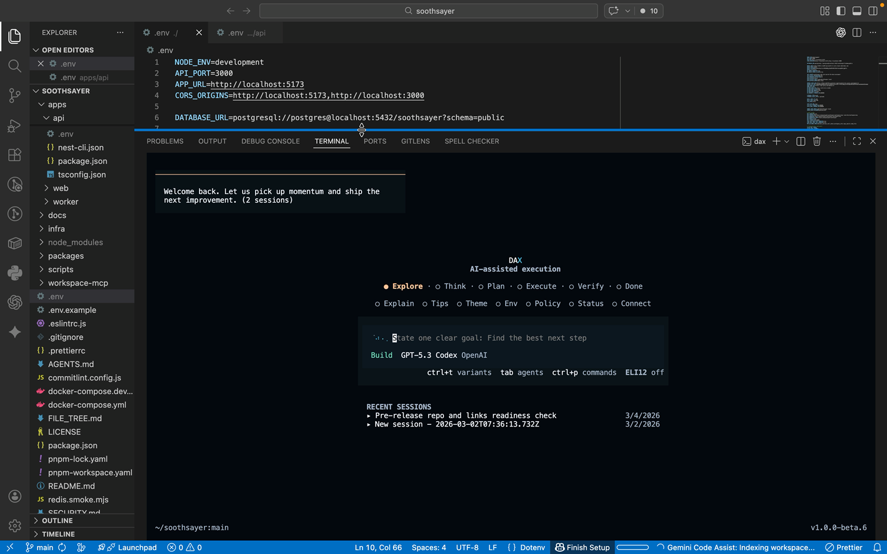

# Build On DAX

This guide explains how to fork and extend DAX for your own product/workflow.

## Extension Areas

- Providers and model routing
- RAO policy behavior
- Prompt assembly and memory behavior
- TUI interaction and panes
- Release/distribution channels

## Local Dev Setup

```bash
git clone https://github.com/dax-ai/dax.git
cd dax
bun install
bun run dev
```

Verification:

```bash
bun run typecheck:dax
bun run test
bun run release:verify
```

## Architecture Entry Points

- CLI bootstrap: `packages/dax/src/index.ts`
- Provider logic: `packages/dax/src/provider/`
- Auth diagnostics: `packages/dax/src/cli/cmd/auth/`
- TUI flow: `packages/dax/src/cli/cmd/tui/`
- Release build: `packages/dax/script/build.ts`

Read first:

- [ARCHITECTURE.md](../ARCHITECTURE.md)
- [PROVIDERS.md](PROVIDERS.md)
- [distribution.md](distribution.md)

## Recommended Customization Sequence

1. Keep core release flow unchanged until your first stable release.
2. Add provider/policy customizations behind feature flags.
3. Add your own docs examples and troubleshooting.
4. Add CI checks for any custom auth or distribution behavior.

## Release Strategy For Forks

1. Run:
   - `bun run release:verify`
   - `bun run release`
2. Publish prerelease:
   - `DAX_VERSION=1.0.0-beta.X bun run release:publish`
3. Go live:
   - `DAX_VERSION=1.0.0-beta.X bun run release:publish:live`
4. Publish channels:
   - Homebrew workflow
   - Winget workflow (after onboarding)

## Screenshots

### 1) Local run from source



Capture:
- Terminal command `bun run dev`
- DAX UI running in same screenshot

### 2) Release assets


Capture:
- Release page asset list with `.tar.gz`, `.zip`, `install.sh`, `manifest.json`

### 3) Distribution workflow success


Capture:
- Green success state for Homebrew or Winget workflow run
