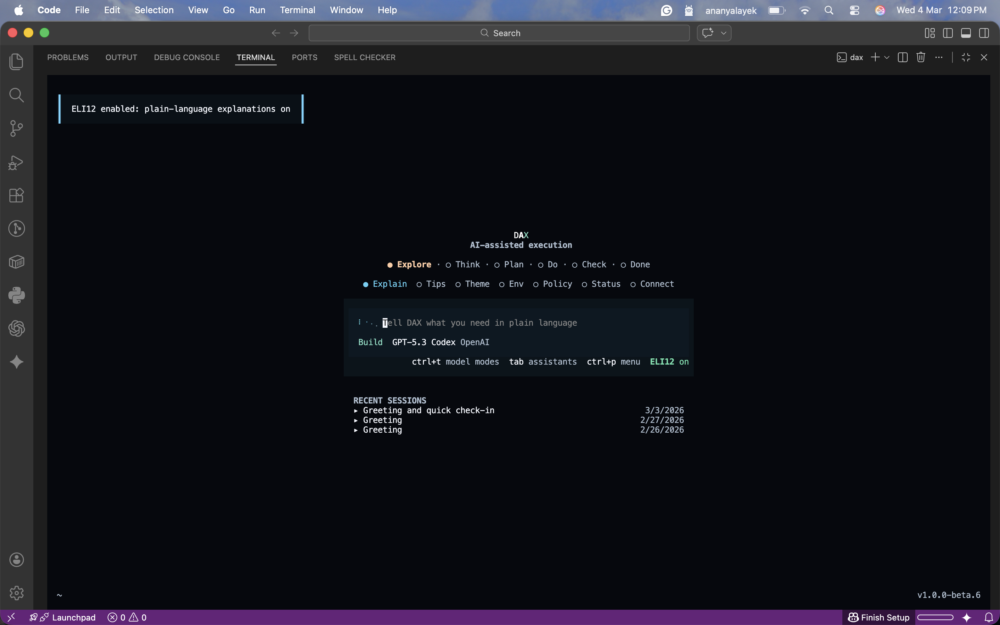
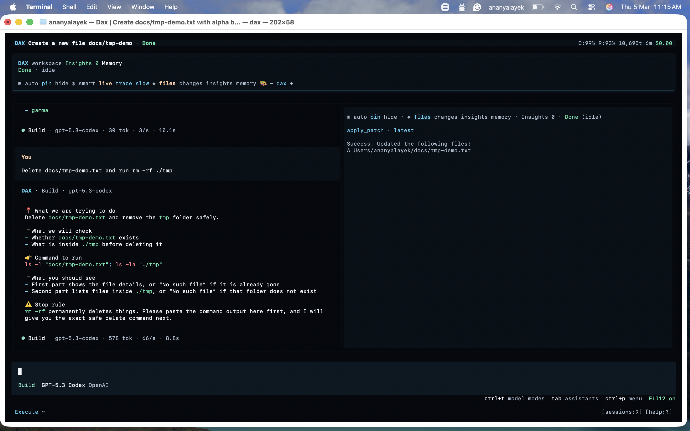
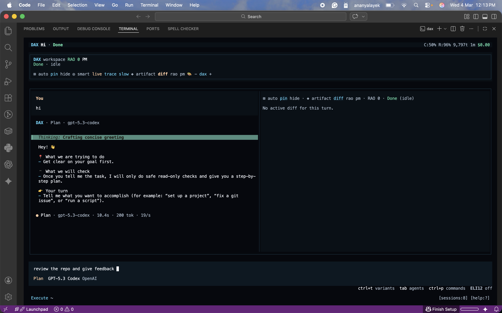

# DAX Non-Dev Quickstart

This guide is for people who do not write code daily but want to use DAX safely and effectively.

## What DAX Does In Plain Language

DAX is an AI teammate that can:

- read project files
- suggest changes
- run commands when approved
- explain what it is doing

DAX follows a safety flow:

1. Run: it proposes work.
2. Audit: it checks risk.
3. Override: you approve or deny.

## 10-Minute Flow

1. Open DAX with `dax`.
2. Ask one narrow question:
   - `Explain this project to me in simple language.`
3. Turn on ELI12 mode if needed for simpler responses.
4. Ask for a safe change:
   - `Only suggest, do not apply yet.`
5. Review `diff` pane before approving anything.

## Safe Prompts You Can Reuse

- `Summarize this codebase for a product manager.`
- `List risks in the current implementation with severity.`
- `Draft release notes from recent changes.`
- `Create a testing checklist for this feature.`

## What Each Pane Means

- `artifact`: latest generated content
- `diff`: file changes
- `rao`: approvals and policy decisions
- `pm`: long-term project memory
- `audit` (beta): release blockers, warnings, and next actions

## How To Read Audit Output Fast

1. Check `status` first (`pass`, `warn`, `fail`).
2. Check `blockers` count.
3. Read the first 1-3 `next_actions`.

If blockers are present, ask DAX:

- `/audit explain <finding_id>`

## When You Should Not Approve

Do not approve immediately if DAX asks to:

- run destructive shell commands
- modify secrets or auth files
- change many files without clear summary
- skip tests/verification

Ask it to do smaller scoped changes first.

## Screenshots

### 1) ELI12 toggle

Capture:
- Home screen
- ELI12 toggle clearly visible

### 2) RAO approval prompt

Capture:
- RAO guardrail response or approve/deny prompt
- Risk/scope context visible

### 3) Diff before approval

Capture:
- One file change pending or just before approval
- Added/removed lines readable

## Common Fixes

- Auth confusion:
  - run `dax auth doctor`
- Model not responding:
  - run `dax models` and pick an available model
- Behavior changed after update:
  - check `dax --version` and re-run auth checks

Deep guide: [non-developer-guide.md](/Users/Shailesh/MYAIAGENTS/dax/docs/non-developer-guide.md)
