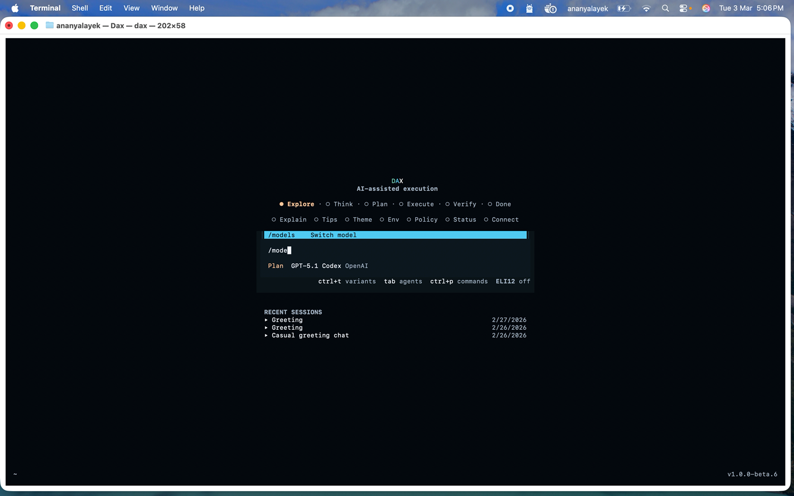
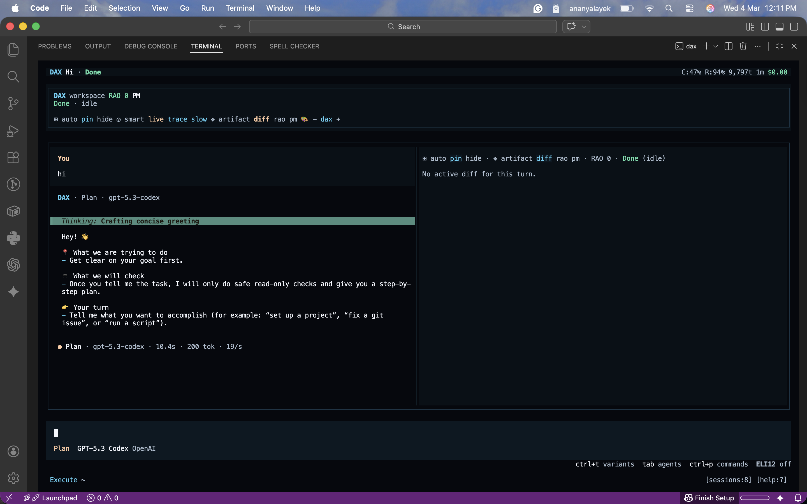
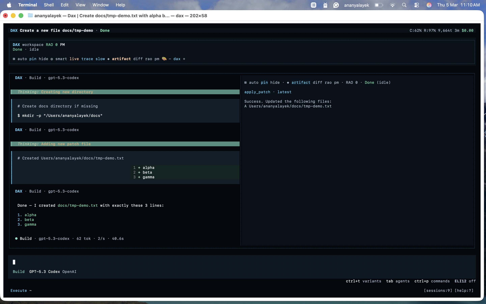

# DAX Start Here

This is the fastest path to first success with DAX.

## What You Need

- macOS, Linux, or Windows terminal
- Internet access for model providers
- A provider credential (OpenAI, Google, Anthropic, etc.)

## Install

For beta releases:

```bash
curl -fsSL https://raw.githubusercontent.com/ShaileshRawat1403/dax-tui/main/script/install.sh | DAX_VERSION=v1.0.0-beta.6 bash
```

Check install:

```bash
dax --version
```

## First Run

Start DAX:

```bash
dax
```

Then:

1. Choose provider/model.
2. Enter a small request, for example: `summarize this repository structure`.
3. Watch the stream stages and response.

## First Real Task

Try:

1. `find all TODO comments and group by file`
2. `propose a safe cleanup plan`
3. `apply the first small cleanup and show the diff`

This gives you a full Run -> Audit -> Override loop with low risk.

## Screenshots

### 1) Home screen



Capture:
- First screen after running `dax`
- Provider/model picker and prompt input both visible

### 2) Session screen + panes



Capture:
- One submitted prompt and response visible
- Side panes (`artifact`, `diff`, `rao`, `pm`) visible

### 3) Diff review



Capture:
- One low-risk file edit
- Added and removed lines visible

## If Something Fails

Run:

```bash
dax --version
dax models
dax auth list
```

For Google-specific auth issues:

```bash
dax auth doctor
dax auth doctor google/gemini-2.5-flash
```

Next guide: [non-dev-quickstart.md](/Users/Shailesh/MYAIAGENTS/dax/docs/non-dev-quickstart.md)
